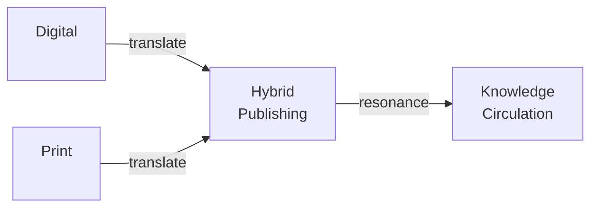
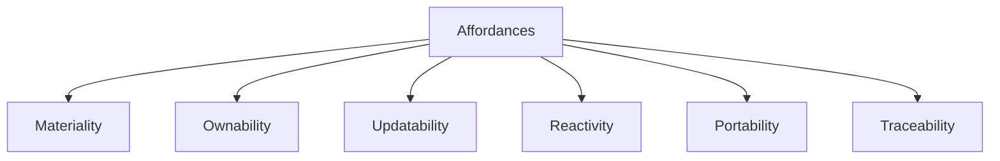
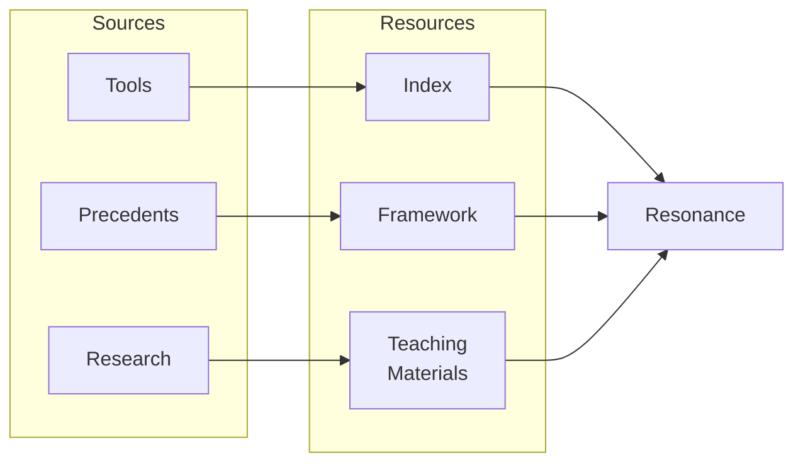
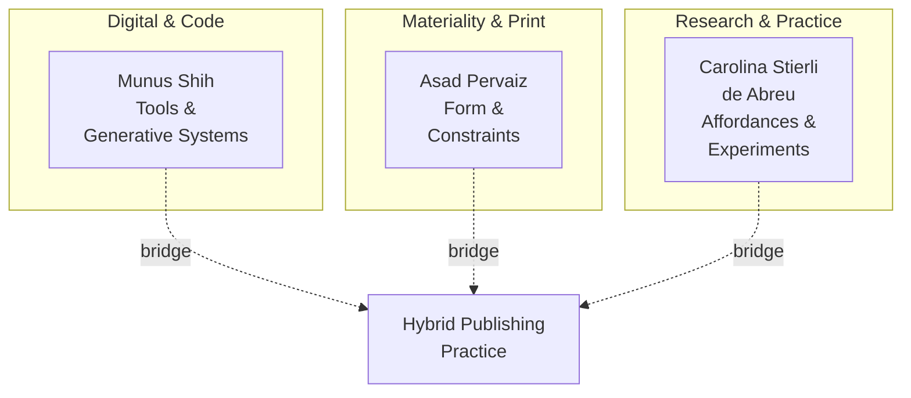

# About

### Research Questions

At the core of this project lies a fundamental inquiry: **what does it mean to publish and design in an era where digital and physical media are deeply intertwined?**

Rather than viewing print and digital as opposing forms, we examine how they overlap, coexist, and mutually inform each other. Specifically, we ask:

**On publishing and translation:** How are works conceived in one medium translated to another? What is lost or gained in that translation? Can the same content exist in radically different forms? Why does content need to be translated, and how does that translation shape meaning?

**On materiality and form:** What does it mean to give digital ideas a tangible, material form? How does the material of a work shape its meaning and interaction? Can the same information be published in multiple materials, each revealing different aspects?

**On access and ownership:** In an era of subscriptions and platforms, what does it mean to truly own a work? How can we create publishing practices that prioritize reader ownership over commercial intermediaries? What are the differences between access and ownership?

**On indexing and architecture:** The early internet was envisioned as an index rather than a container. How have our relationships to indexing, searching, and cataloging changed? Can the structural logic of the web be translated into print? What new forms emerge when we prioritize connection over sequence?

**On impermanence and change:** How do we publish work that acknowledges its own mutability? What frameworks allow content to be updated, adapted, or reinterpreted while still maintaining integrity? How can we document the traces of change itself?

### Our Approach

We identify and document affordances: the possibilities for action offered by different media. We study how hybrid publishing practices translate these across formats.

The key affordances we explore are:

**Materiality:** The ability to derive meaning from what can be observed or touched. What materials can host this work, and how does each material shape the experience?

**Ownability:** The ability for work to be permanently owned by readers and accessed without interruption, regardless of future changes by publishers or platforms.

**Updatability:** The capacity to keep changing and adapting work even after it has been published, moving beyond static, immutable forms.

**Reactivity:** The ability for viewers to give feedback and for the medium to adopt that feedback in real time, creating feedback loops between creator and reader.

**(Tele)Portability:** The ability to navigate within a work by pinpointing areas of interest and jumping directly to them, translating hyperlinks and indexes across media.

**Traceability:** The ability to record paths, versions, and interactions, documenting how work evolves and how readers engage with it.

Rather than choosing between print and digital, we explore how these affordances reveal new possibilities when translated across media, enabling hybrid practices that leverage the strengths of each form.

### What We're Building

This archive serves as both a tool and a reference:

- **An index** documenting hybrid publishing practices, tools, and precedents that explore the intersection of print and digital
- **A framework** for understanding and identifying affordances across media, providing language to discuss what makes certain publishing practices hybrid
- **Teaching resources** that present these concepts through workshops, examples, and experiments for students and educators
- **A research collection** of parallel histories, readings, and interviews supporting designers and creators exploring expanded approaches to publishing

The project acknowledges that publishing is no longer a question of readership alone, but of resonance. How ideas ripple through different forms and communities.

### Who We Are

**Munus Shih** brings a digital and code perspective, exploring how technology and creative coding enable new publishing possibilities through tools like p5.js and generative design systems.

**Asad Pervaiz** approaches from the materiality of print, examining how form, material, constraints, and production methods shape what can be published and how it is experienced.

**Carolina Stierli de Abreu** engages as a researcher and maker, exploring affordances and tools from a student's perspective, bridging theory and practice.

Together, we believe that the future of publishing isn't choosing between print and digital, but understanding what each offers and building bridges between them.

